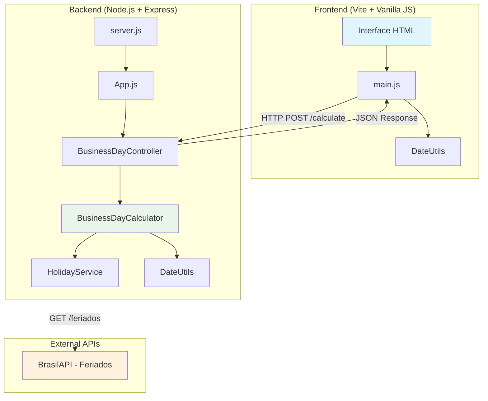
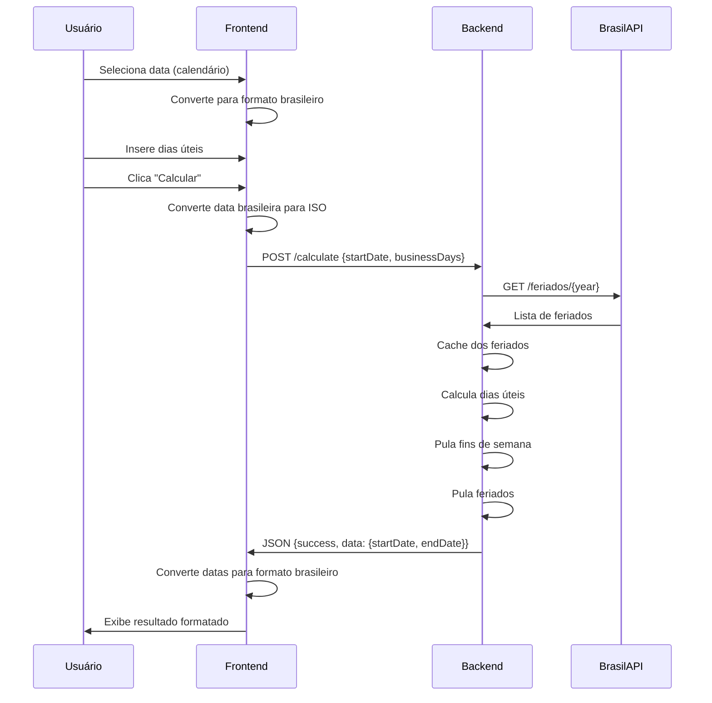
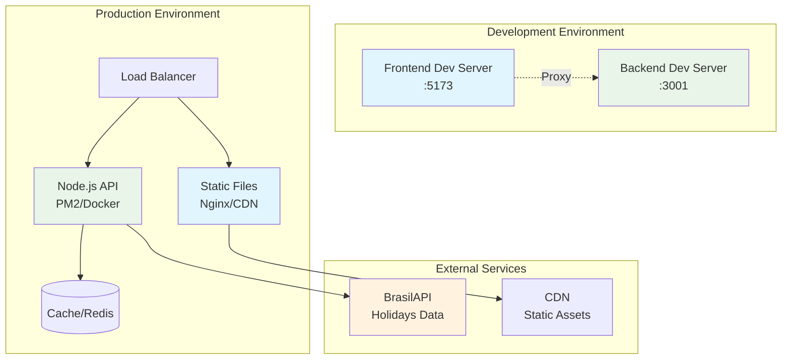
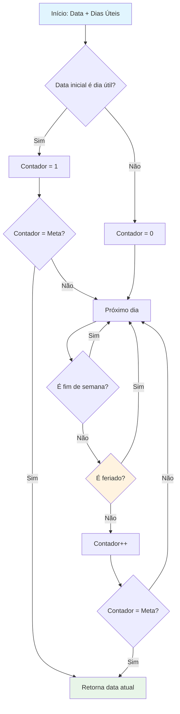
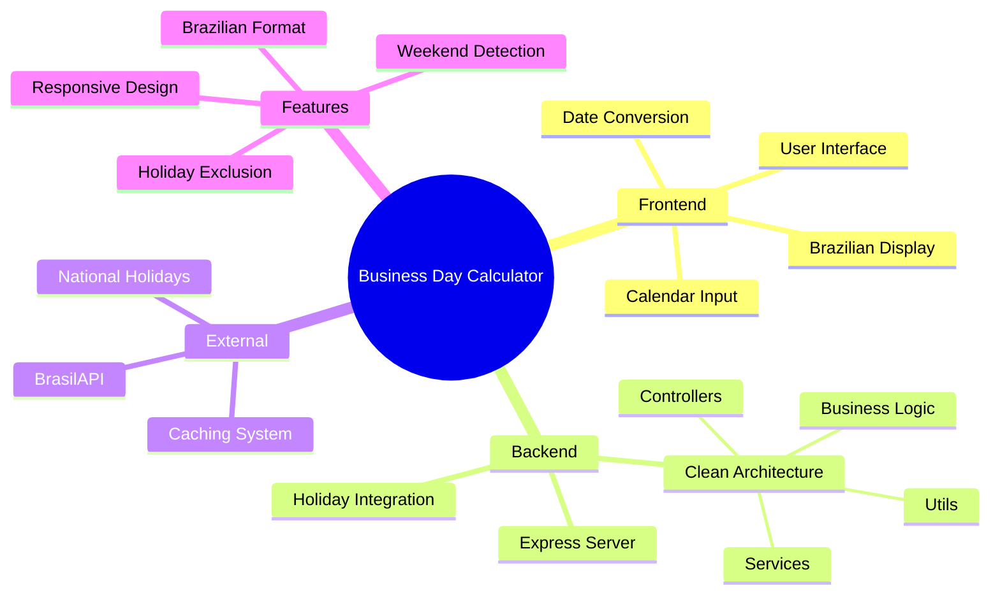

# 🇧🇷 Calculadora de Dias Úteis - Business Day Calculator

Um sistema completo para calcular datas finais considerando dias úteis e feriados nacionais brasileiros.

## 📁 Estrutura do Projeto

```
├── backend/              # API REST em Node.js + Express
│   ├── src/             # Código fonte refatorado
│   │   ├── calculators/ # Lógica de cálculo de dias úteis
│   │   ├── controllers/ # Controladores HTTP
│   │   ├── services/    # Integração com APIs externas
│   │   ├── utils/       # Utilitários de data
│   │   └── config/      # Configurações
│   ├── tests/           # Testes unitários
│   ├── server.js        # Entry point da aplicação
│   └── README.md        # Documentação do backend
│
├── frontend/            # Interface web com Vite
│   ├── index.html      # Interface principal
│   ├── main.js         # Lógica do frontend
│   ├── vite.config.js  # Configuração do Vite
│   └── README.md       # Documentação do frontend
│
└── REFACTORING_SUMMARY.md # Documentação das melhorias

```

## 🏗️ Arquitetura do Sistema



## 🔄 Fluxo de Dados



## 🚀 Quick Start

### 1. Backend (API)
```bash
cd backend/
npm install
npm start
```
API estará disponível em: http://localhost:3001

### 2. Frontend (Interface)
```bash
cd frontend/
npm install
npm run dev
```
Interface estará disponível em: http://localhost:5173

## 🚀 Deployment Architecture



## 🌟 Funcionalidades

### 📅 **Cálculo Inteligente**
- Considera apenas dias úteis (segunda a sexta-feira)
- Exclui automaticamente feriados nacionais brasileiros
- Integração com BrasilAPI para dados atualizados

### 🎯 **Interface Brasileira**
- Seleção de data via calendário nativo
- Exibição em formato brasileiro (dd/mm/aaaa)
- Conversões automáticas e transparentes
- Validação inteligente de datas

### 🏗️ **Arquitetura Limpa**
- Princípios SOLID aplicados
- Separação clara de responsabilidades
- Código testável e manutenível
- Documentação completa

## 📋 Endpoints da API

### Health Check
```http
GET /health
```

### Calcular Dias Úteis
```http
POST /calculate
Content-Type: application/json

{
  "startDate": "2025-11-17",
  "businessDays": 5
}
```

### Legacy (Português)
```http
POST /calcular
Content-Type: application/json

{
  "dataInicial": "2025-11-17",
  "diasUteis": 5
}
```

## 💡 Exemplo de Uso

**Input:** 17/11/2025 + 5 dias úteis  
**Output:** 24/11/2025  

*Considerando que 20/11/2025 é feriado (Consciência Negra)*

## 🧮 Business Logic Flow



## 📊 System Components



## 🛠️ Tecnologias

### Backend
- **Node.js** - Runtime JavaScript
- **Express** - Framework web
- **BrasilAPI** - Dados de feriados nacionais
- **ESModules** - Sistema de módulos moderno

### Frontend  
- **Vite** - Build tool e dev server
- **Vanilla JavaScript** - Sem frameworks pesados
- **CSS3** - Styling moderno e responsivo
- **HTML5** - Semântica e acessibilidade

## 📖 Documentação Detalhada

- [Backend README](./backend/README.md) - API, arquitetura e endpoints
- [Frontend README](./frontend/README.md) - Interface, UX e conversões
- [Refactoring Summary](./REFACTORING_SUMMARY.md) - Melhorias e boas práticas

## ✨ Características Destacadas

- 🇧🇷 **100% Brasileiro**: Formato de datas, feriados e interface
- 📱 **Responsivo**: Funciona perfeitamente em mobile
- ⚡ **Rápido**: Cache de feriados e otimizações
- 🔒 **Confiável**: Validação completa e tratamento de erros
- 🧪 **Testado**: Testes unitários e validação
- 📚 **Documentado**: README completo e JSDoc

## 🎯 Status do Projeto

- ✅ **Backend**: Produção-ready com Clean Architecture
- ✅ **Frontend**: Interface moderna e acessível  
- ✅ **Integração**: BrasilAPI para feriados atualizados
- ✅ **Testes**: Cobertura de casos principais
- ✅ **Documentação**: Completa e atualizada

---

**Desenvolvido com ❤️ para facilitar o cálculo de prazos no Brasil** 🇧🇷
