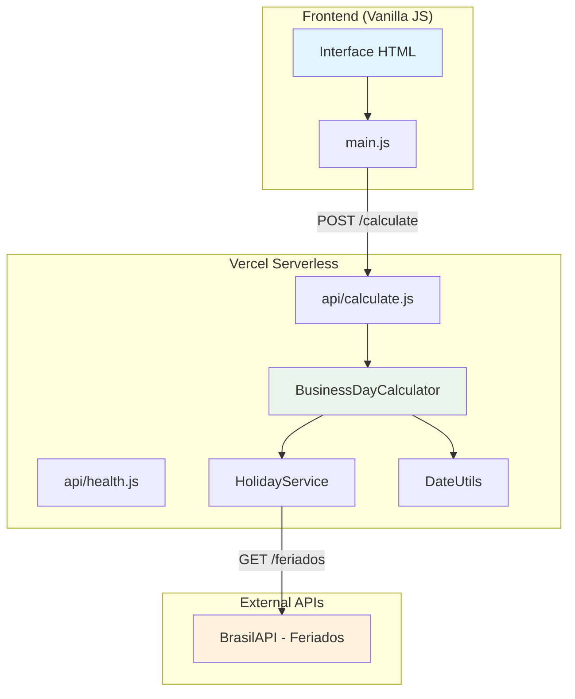

# 🇧🇷 Calculadora de Dias Úteis - Business Day Calculator

Um sistema completo para calcular datas finais considerando dias úteis e feriados nacionais brasileiros.

**🌐 Acesse em: [workdays.devbolsoni.com.br](https://workdays.devbolsoni.com.br)**

## 📁 Estrutura do Projeto

```
workdays-br/
├── api/                    # Serverless Functions (Vercel)
│   ├── calculate.js        # POST /api/calculate
│   └── health.js           # GET /api/health
├── src/                    # Lógica de negócio
│   ├── calculators/        # BusinessDayCalculator
│   ├── controllers/        # BusinessDayController
│   ├── services/           # HolidayService (BrasilAPI)
│   ├── utils/              # DateUtils
│   └── config/             # Configurações
├── tests/                  # Testes unitários (66 testes)
│   ├── calculators/
│   ├── controllers/
│   ├── services/
│   └── utils/
├── public/                 # Frontend estático
│   ├── index.html
│   └── main.js
├── package.json
└── vercel.json             # Configuração Vercel
```

## 🏗️ Arquitetura do Sistema


```mermaid
graph TB
    subgraph "Frontend (Vanilla JS)"
        UI[Interface HTML]
        JS[main.js]
        UI --> JS
    end

    subgraph "Vercel Serverless"
        Health[api/health.js]
        Calculate[api/calculate.js]
        Calculator[BusinessDayCalculator]
        HolidayService[HolidayService]
        DateUtils[DateUtils]
        
        Calculate --> Calculator
        Calculator --> HolidayService
        Calculator --> DateUtils
    end

    subgraph "External APIs"
        BrasilAPI[BrasilAPI - Feriados]
    end

    JS -->|POST /calculate| Calculate
    HolidayService -->|GET /feriados| BrasilAPI

    style UI fill:#e1f5fe
    style BrasilAPI fill:#fff3e0
    style Calculator fill:#e8f5e8
```

## 🚀 Quick Start

### Desenvolvimento Local

```bash
# Instalar dependências
npm install

# Rodar localmente (Vercel Dev)
npx vercel dev

# Executar testes
npm test
```

### Deploy

```bash
# Preview
npx vercel

# Produção
npx vercel --prod
```

## 📋 Endpoints da API

### Health Check
```http
GET /health
```
```json
{
  "status": "OK",
  "timestamp": "2026-03-17T02:09:57.471Z",
  "service": "Business Day Calculator API",
  "environment": "Vercel Serverless"
}
```

### Calcular Dias Úteis
```http
POST /calculate
Content-Type: application/json

{
  "startDate": "2026-03-17",
  "businessDays": 5
}
```
```json
{
  "success": true,
  "data": {
    "startDate": "2026-03-17",
    "businessDays": 5,
    "endDate": "2026-03-23"
  }
}
```

### Legacy (Português)
```http
POST /calcular
Content-Type: application/json

{
  "dataInicial": "2026-03-17",
  "diasUteis": 5
}
```

## 🧪 Testes

O projeto possui **66 testes unitários** cobrindo:

| Módulo | Testes | Cobertura |
|--------|--------|-----------|
| DateUtils | 9 | createSafeDate, formatToISODate, isWeekend, isHoliday, isBusinessDay |
| BusinessDayCalculator | 26 | Validação, cálculo, feriados, fins de semana, virada de ano |
| HolidayService | 15 | Cache, integração API, múltiplos anos |
| BusinessDayController | 16 | HTTP 400/500, validação, segurança |

```bash
npm test
```

## 🌟 Funcionalidades

### 📅 **Cálculo Inteligente**
- Considera apenas dias úteis (segunda a sexta-feira)
- Exclui automaticamente feriados nacionais brasileiros
- Integração com BrasilAPI para dados atualizados
- Cache de feriados para performance

### 🎯 **Interface Brasileira**
- Seleção de data via calendário nativo
- Exibição em formato brasileiro (dd/mm/aaaa)
- Conversões automáticas e transparentes

### 🏗️ **Arquitetura Limpa**
- Princípios SOLID aplicados
- Separação clara de responsabilidades
- Código testável e manutenível
- Serverless Functions (Vercel)

## 💡 Exemplo de Uso

**Input:** 17/03/2026 + 5 dias úteis  
**Output:** 23/03/2026

## 🛠️ Tecnologias

- **Node.js 18+** - Runtime JavaScript
- **Vercel** - Serverless Functions + Hosting
- **BrasilAPI** - Dados de feriados nacionais
- **Vanilla JavaScript** - Frontend sem frameworks

## 🔗 URLs

| Ambiente | URL |
|----------|-----|
| **Produção** | https://workdays.devbolsoni.com.br |
| **Vercel** | https://workdays-br.vercel.app |

## ✨ Características

- 🇧🇷 **100% Brasileiro**: Formato de datas e feriados
- ⚡ **Serverless**: Escala automática, sem gerenciamento de servidor
- 🧪 **66 Testes**: Cobertura completa
- 📱 **Responsivo**: Funciona em mobile
- 🔒 **Seguro**: Validação completa e tratamento de erros

---

**Desenvolvido com ❤️ para facilitar o cálculo de prazos no Brasil** 🇧🇷
