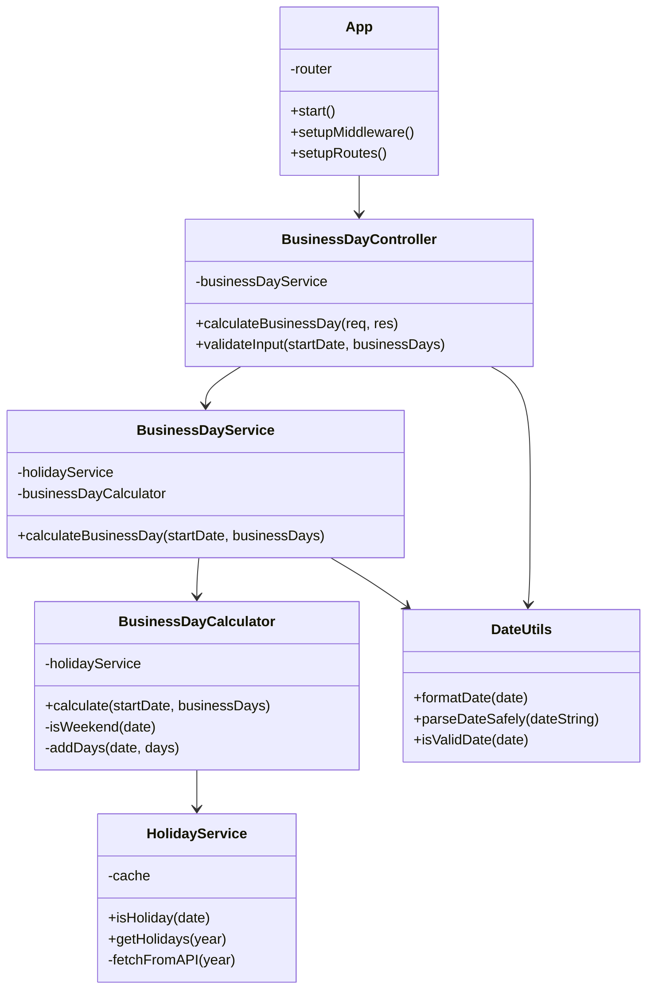
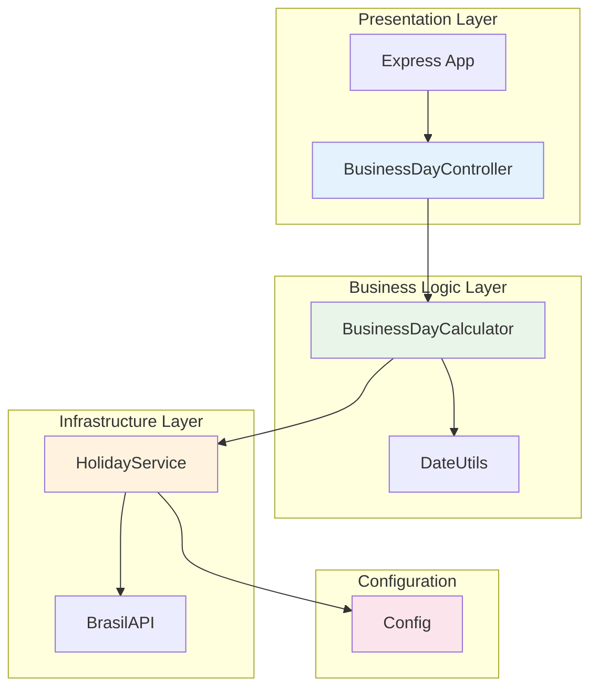
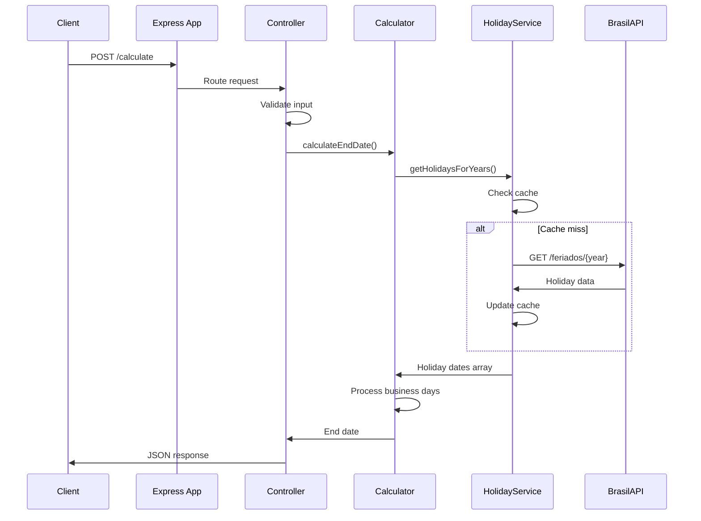

# Business Day Calculator API

A robust REST API for calculating business days considering Brazilian national holidays.

## 🚀 Features

- Calculate end dates considering business days only
- Automatically excludes weekends ## Arquitetura SOLID

Este projeto segue os princípios SOLID para garantir código limpo, manutenível e testável:

- **S**ingle Responsibility: Cada classe tem apenas uma responsabilidade
- **O**pen/Closed: Aberto para extensão, fechado para modificação
- **L**iskov Substitution: Subclasses podem substituir classes base
- **I**nterface Segregation: Interfaces específicas em vez de genéricas
- **D**ependency Inversion: Depender de abstrações, não de implementações


GET /health
```
Returns API status and information.

### Calculate Business Days (English)
```
POST /calculate
Content-Type: application/json

{
  "startDate": "2025-11-17",
  "businessDays": 5
}
```

### Calculate Business Days (Portuguese - Legacy)
```
POST /calcular
Content-Type: application/json

{
  "dataInicial": "2025-11-17",
  "diasUteis": 5
}
```

## 📝 Response Format

### Success Response
```json
{
  "success": true,
  "data": {
    "startDate": "2025-11-17",
    "businessDays": 5,
    "endDate": "2025-11-24"
  }
}
```

### Error Response
```json
{
  "error": "Validation Error",
  "message": "Start date must be in YYYY-MM-DD format"
}
```

## 🏗️ Architecture Changes

### Before (Monolithic)
- Single `server.js` file with all logic
- Mixed Portuguese/English variables
- No separation of concerns
- Basic error handling
- No tests

### After (Clean Architecture)
```
src/
├── config/           # Configuration management
│   └── Config.js
├── controllers/      # HTTP layer
│   └── BusinessDayController.js
├── services/         # External APIs
│   └── HolidayService.js
├── calculators/      # Business logic
│   └── BusinessDayCalculator.js
├── utils/           # Helper functions
│   └── DateUtils.js
└── App.js           # Application setup
```

## 🔧 Clean Architecture Diagram



## 🔄 Request Flow



### Key Components

- **HolidayService**: Handles Brazilian holiday data fetching and caching
- **DateUtils**: Provides timezone-safe date operations
- **BusinessDayCalculator**: Core business logic for calculating business days
- **BusinessDayController**: HTTP request/response handling
- **App**: Application configuration and routing

## 🧪 Testing

Run tests with:
```bash
npm test
```

Run tests in watch mode:
```bash
npm run test:watch
```

## 🛠️ Development

Start development server with auto-reload:
```bash
npm run dev
```

## 📦 Installation

```bash
npm install
npm start
```

## 🌟 Examples

### Example 1: Regular business days
```bash
curl -X POST http://localhost:3001/calculate \
  -H "Content-Type: application/json" \
  -d '{"startDate":"2025-11-17","businessDays":5}'
```

Response: `2025-11-24` (skips weekend and holiday on Nov 20th)

### Example 2: Starting on weekend
```bash
curl -X POST http://localhost:3001/calculate \
  -H "Content-Type: application/json" \
  -d '{"startDate":"2025-11-16","businessDays":1}'
```

Response: `2025-11-17` (first business day after Sunday)

## 🔧 Configuration

The application can be configured through environment variables:

- `PORT`: Server port (default: 3001)
- `NODE_ENV`: Environment (development/production)

## 📚 Dependencies

- **Express**: Web framework
- **node-fetch**: HTTP client for holiday API
- **BrasilAPI**: Brazilian holiday data source

## 🎯 Design Principles Applied

### SOLID Principles
- **Single Responsibility**: Each class has one reason to change
- **Open/Closed**: Open for extension, closed for modification
- **Liskov Substitution**: Derived classes are substitutable for base classes
- **Interface Segregation**: No client depends on methods it doesn't use
- **Dependency Inversion**: Depend on abstractions, not concretions

### Clean Code Practices
- Meaningful names for variables and functions
- Small, focused functions
- Consistent error handling
- Comprehensive documentation
- No magic numbers or strings
- Proper separation of concerns
