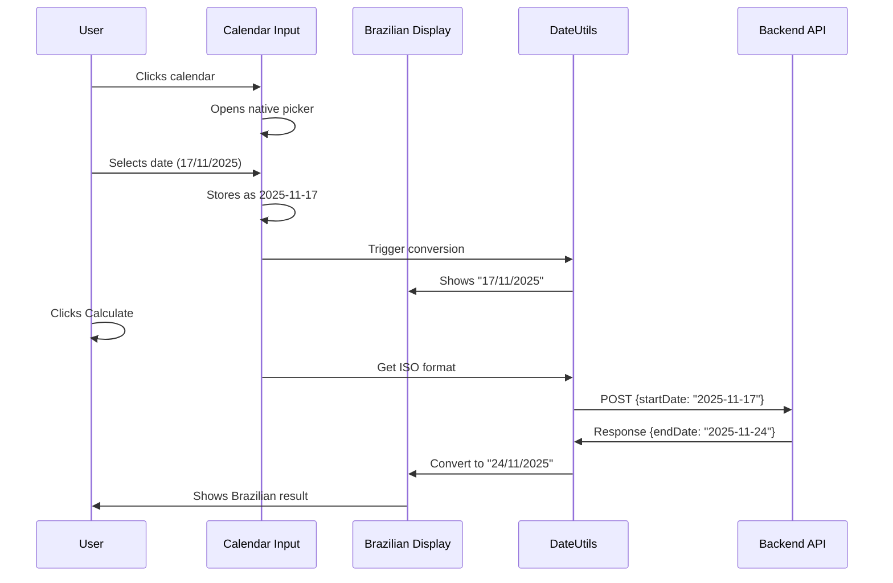
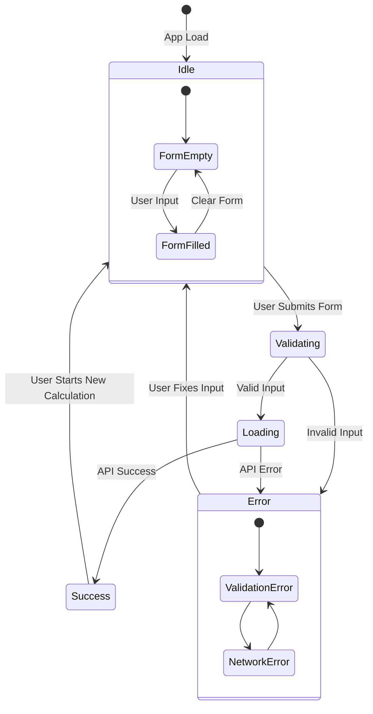
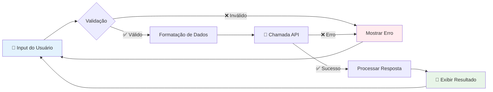

# Frontend - Calculadora de Dias Úteis

## 🇧🇷 Características Brasileiras

Este frontend foi desenvolvido especificamente para usuários brasileiros, com as seguintes funcionalidades:

### 📅 Seleção de Data Híbrida

- **Input tipo date**: Permite seleção via calendário nativo do navegador
- **Exibição brasileira**: Mostra a data selecionada no formato dd/mm/aaaa
- **Conversão automática**: Para formato ISO `yyyy-mm-dd` enviado à API
- **Data padrão**: Campo preenchido com a data atual automaticamente

## 🎯 Interface Flow Diagram

```mermaid
graph LR
    subgraph "User Interface"
        Calendar[📅 Calendar Input]
        Display[🇧🇷 Brazilian Display]
        Button[🔢 Calculate Button]
        Result[📊 Result Display]
    end

    subgraph "Date Conversion"
        ISOFormat[yyyy-mm-dd]
        BRFormat[dd/mm/aaaa]
    end

    subgraph "Backend API"
        API[/calculate endpoint]
    end

    Calendar -->|select date| Display
    Display -->|shows| BRFormat
    Calendar -->|internal value| ISOFormat
    Button -->|sends| ISOFormat
    ISOFormat -->|HTTP POST| API
    API -->|JSON response| ISOFormat
    ISOFormat -->|convert back| BRFormat
    BRFormat -->|display| Result

    style Calendar fill:#e1f5fe
    style Display fill:#e8f5e8
    style API fill:#fff3e0
```

## 🔄 Date Conversion Flow



### 🎯 Funcionalidades

## Estados da Aplicação

A interface passa por diferentes estados durante o cálculo:



## Fluxo de Dados



#### Dupla Interface
- **Calendário nativo**: Clique no campo para abrir o seletor de data
- **Display brasileiro**: Visualização da data no formato brasileiro logo abaixo
- **Sincronização automática**: Mudanças no calendário atualizam o display brasileiro

#### Validação Automática
- **Input date**: Garante apenas datas válidas via calendário
- **Verificação de seleção**: Confirma que uma data foi escolhida
- **Feedback visual**: Display colorido mostra a data selecionada

#### Experiência de Usuário
- **Flexibilidade**: Use o calendário ou veja em formato brasileiro
- **Clareza visual**: Data brasileira destacada em cor diferente
- **Responsividade**: Funciona bem em mobile e desktop

### 🛠️ Implementação Técnica

#### Utilitários de Data
```javascript
DateUtils = {
  brazilianToISO(brazilianDate),    // "17/11/2025" → "2025-11-17"
  isoToBrazilian(isoDate),          // "2025-11-17" → "17/11/2025"
  isValidBrazilianDate(date),       // Validação completa
  getTodayBrazilian()               // Data atual brasileira
}
```

#### Fluxo de Conversão
1. **Usuário seleciona**: Data via calendário (ex: 17/11/2025)
2. **Display atualiza**: Mostra "17/11/2025" em formato brasileiro
3. **Conversão interna**: Para "2025-11-17" (formato API)
4. **Envio**: JSON com formato ISO para backend
5. **Recebimento**: Resposta da API em ISO
6. **Conversão de volta**: "2025-11-28" → "28/11/2025"
7. **Exibição**: Resultado em formato brasileiro para o usuário

### 🎨 Interface em Português

- **Títulos**: "Calculadora de Dias Úteis"
- **Labels**: "Data Inicial", "Dias Úteis"
- **Display da data**: "Data selecionada: dd/mm/aaaa"
- **Mensagens**: Todas em português brasileiro
- **Validação**: Mensagens de erro em português
- **Resultados**: Formatação brasileira

### 📱 Experiência do Usuário

#### Feedback Visual
- ✅ **Calendário nativo**: Interface familiar do sistema
- 📅 **Display brasileiro**: Data formatada destacada
- ✅ **Sucesso**: Fundo verde com resultado detalhado
- ❌ **Erro**: Fundo vermelho com explicação clara
- ⏳ **Loading**: Indicador durante cálculo

#### Responsividade
- Design adaptado para mobile
- Campos de entrada otimizados para touch
- Texto legível em todas as telas

### 🔄 Compatibilidade

#### Endpoints Suportados
- `/calculate` (novo, formato inglês)
- `/calcular` (legacy, formato português)

#### Conversões Automáticas
```javascript
// Entrada do usuário
"17/11/2025" + 5 dias

// Envio para API
{"startDate": "2025-11-17", "businessDays": 5}

// Resposta da API
{"startDate": "2025-11-17", "endDate": "2025-11-24"}

// Exibição para usuário
"Data Inicial: 17/11/2025"
"Data Final: 24/11/2025"
```

### 🧪 Testes

Para testar as conversões:
```bash
# Abrir o arquivo de teste
open test-dates.html
```

### 🚀 Como Usar

1. **Inicie o servidor**:
   ```bash
   npm run dev
   ```

2. **Acesse**: http://localhost:5173 (ou 5174)

3. **Selecione uma data**:
   - Clique no campo de data para abrir o calendário
   - Ou use as setas para navegar
   - Veja a data em formato brasileiro logo abaixo

4. **Informe os dias úteis**: 5

5. **Clique em Calcular**

6. **Veja o resultado em formato brasileiro**

### 💡 Exemplos de Uso

#### Seleção via Calendário
- Clique no campo → Abre calendário nativo
- Navegue pelos meses → Selecione o dia
- Display atualiza → Mostra formato brasileiro

#### Entrada via Teclado
- Use setas para navegar
- Digite números para ir rapidamente
- Tab para avançar campos

### 🎉 Resultado

O sistema agora oferece uma experiência híbrida perfeita:
- ✅ **Calendário nativo**: Familiar e acessível
- ✅ **Formato brasileiro**: Visualização dd/mm/aaaa
- ✅ **Interface em português**: Textos localizados
- ✅ **Validação automática**: Input date garante datas válidas
- ✅ **Conversões transparentes**: ISO ↔ Brasileiro
- ✅ **Feedback visual**: Display destacado da data selecionada
